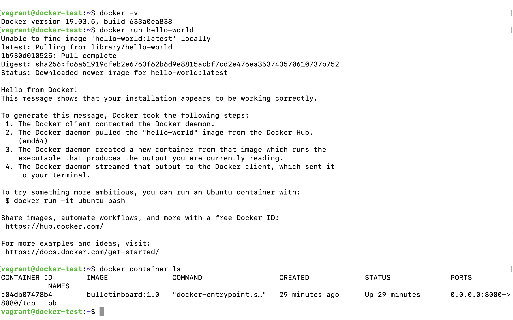
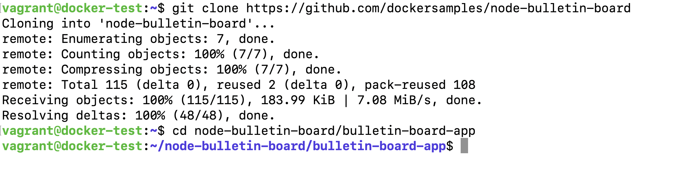
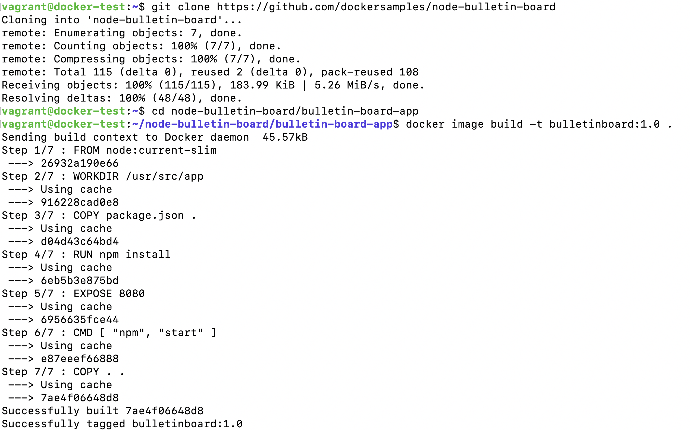
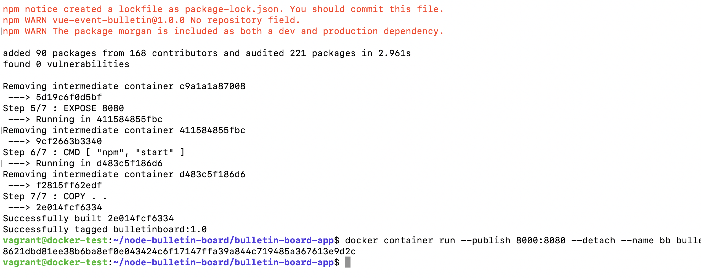
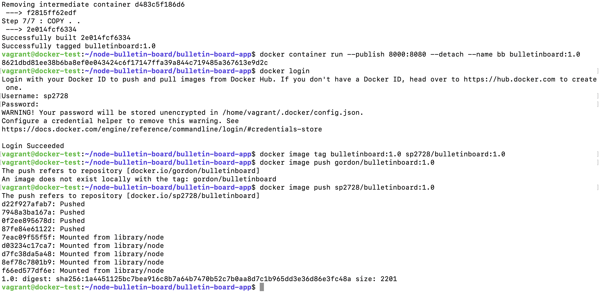
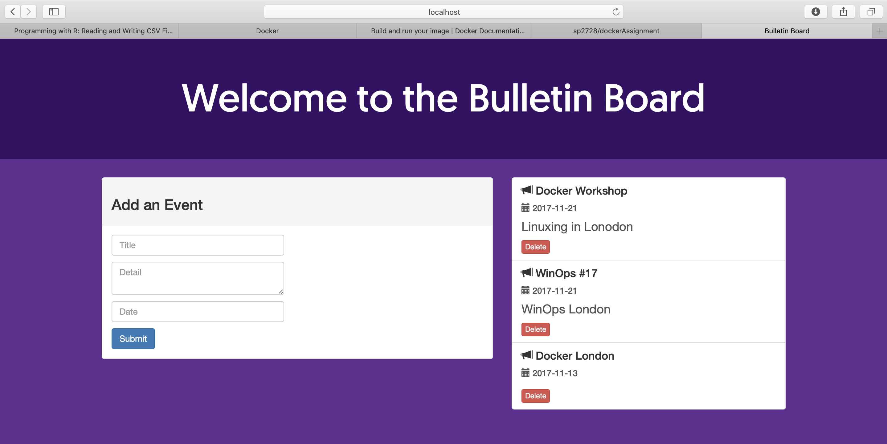

# dockerAssignment

## Steps for Working on Docker: 

### 1. Docker run hello-world

### 2. Cloning Tutorial Repository

### 3. Building Image for Docker

### 4. Creating a Docker Container 

### 5. Connecting to Docker Hub 

### 6. Launching the application in the browser

